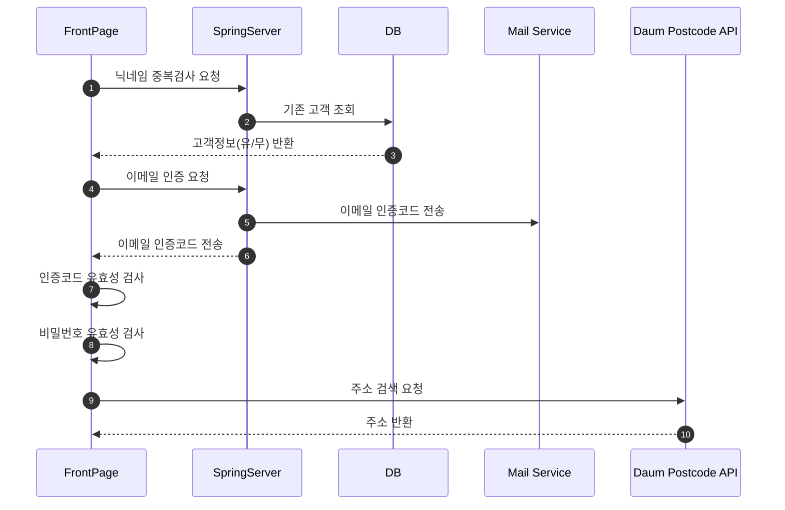
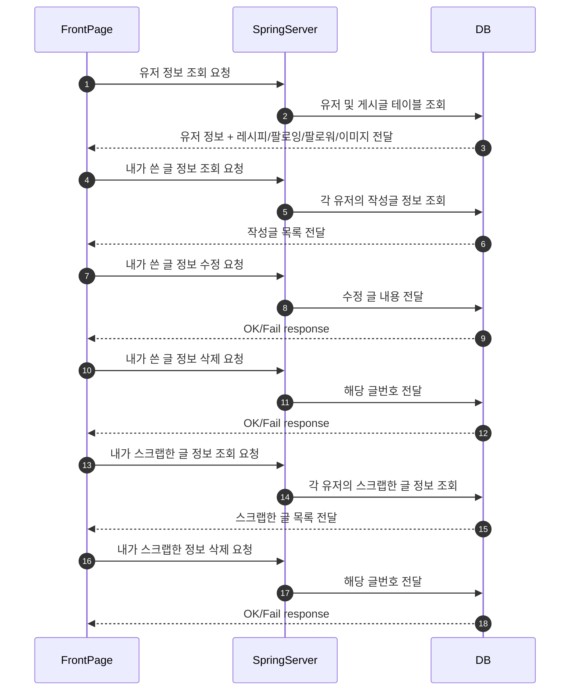
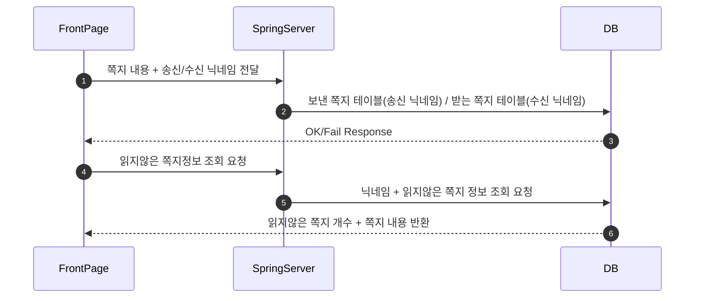
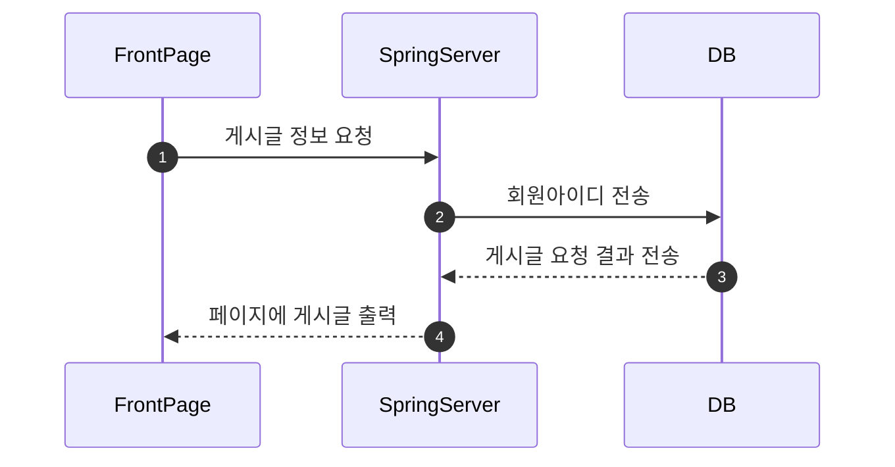
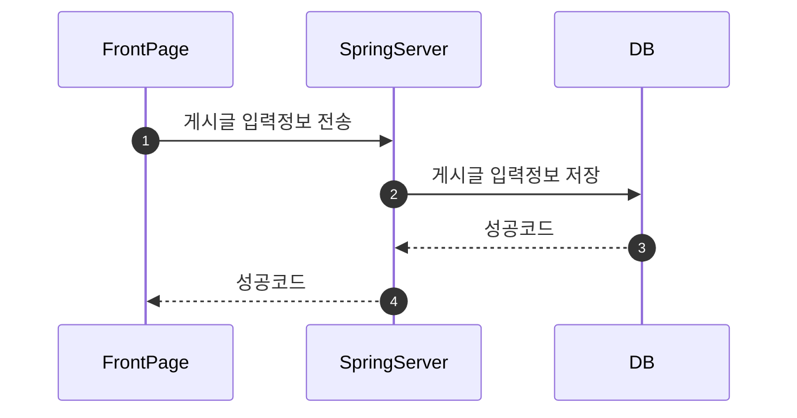
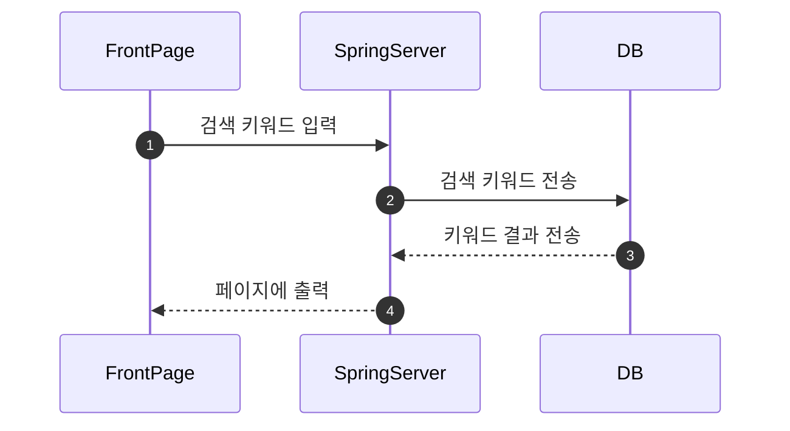
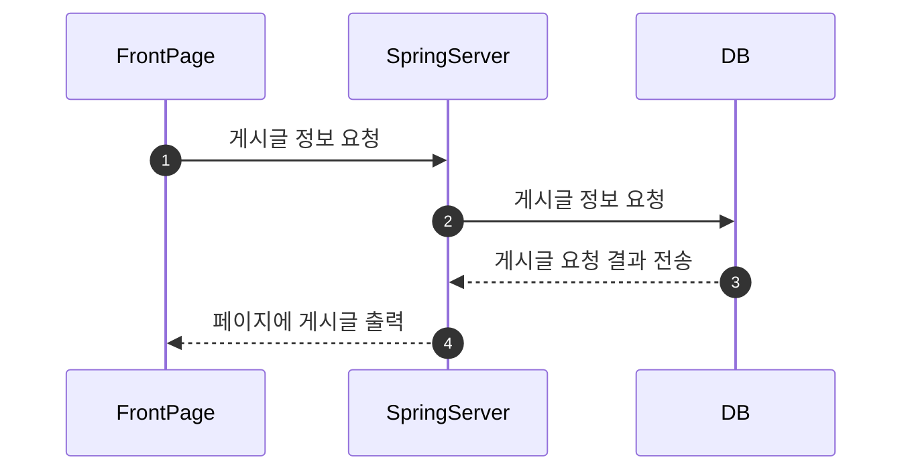
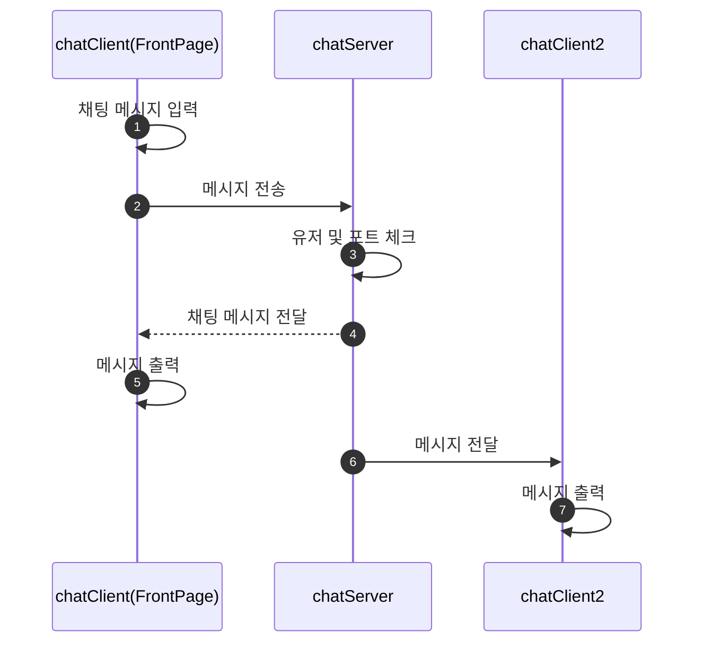
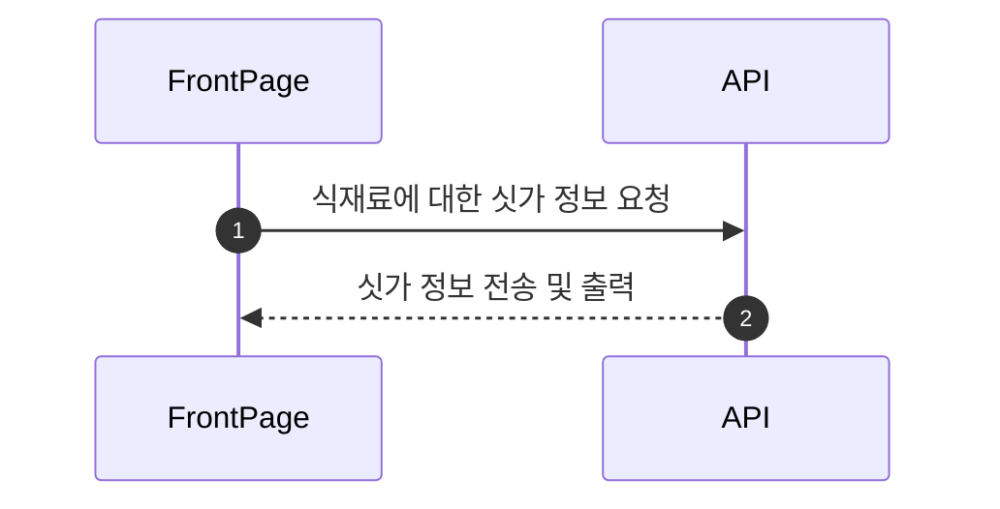
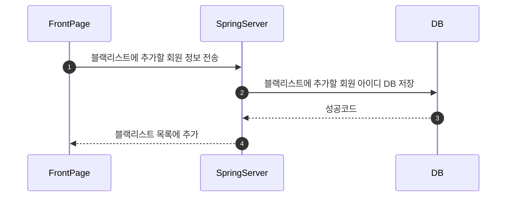

# 우리 동네 냉장고

## 1. 회원 가입

회원가입은 회원정보 (닉네임, 이메일, 비밀번호, 주소)를 입력하며 SpringServer를 통해 DB와 연결하여 실시간 닉네임 중복검사, 이메일 인증, 비밀번호 확인 및 Daum Postcode API를 통한 주소입력이 이뤄진다.

## 2. 마이페이지

마이페이지는 개인 피드와 레시피 및 팔로잉/팔로워수를 나타낸다, 또한 내가 쓴 글관리와 스크랩한 글 관리가 가능하다.

## 3. 쪽지 기능

회원간 1:1 쪽지전송 및 조회가 가능하다.

## 4. 레시피 공유 게시판

레시피 공유 게시판 페이지를 호출하면 DB에 저장된 게시글에 대한 정보를 가져온다.

## 5. 레시피 게시글 등록

사진, 레시피, 재료 등 정보를 입력하여 게시글을 DB에 저장한다.

## 6. 레시피 게시글 검색

레시피 공유 페이지의 검색 기능을 이용하여 키워드로 검색을 할 수 있다.

## 7. 공동구매 게시판

공동구매 게시판 페이지를 호출하면 DB에 저장된 게시글에 대한 정보를 가져와 지도 또는 목록으로 출력한다.

## 8. 공동구매 단체 채팅

채팅 서버는 별도의 채팅 서버를 거쳐 서비스 된다. 공동구매 채팅방에 참여한 사람들과 채팅을 할 수 있다.

## 9. 공동구매 게시글 등록

인원수, 공동구매 재료 등 정보를 입력하여 게시글을 DB에 저장한다.

## 10. 공동구매 게시글 검색

공동구매 페이지의 검색 기능을 이용하여 키워드로 검색을 할 수 있다.

## 11. 현재 싯가 표시

API를 요청해 현재 식재료 싯가를 출력한다.

## 12. 물물교환 게시판

물물교환 게시판 페이지를 호출하면 DB에 저장된 게시글에 대한 정보를 가져와 지도 또는 목록으로 출력한다.

## 13. 물물교환 게시글 등록

사진, 현재 싯가, 교환가능재료, 내위치, 구매/판매 등 정보를 입력하여 게시글을 DB에 저장한다.

## 14. 물물교환 게시글 검색

물물교환 페이지의 검색 기능을 이용하여 키워드(관심 재료, 물물교환 가능 재료 또는 가격)로 검색을 할 수 있다.

## 15. 물물교환 1:1 채팅

채팅 서버는 별도의 채팅 서버를 거쳐 서비스 된다. 물물교환 게시물에서 1:1 채팅 버튼을 누르면 1:1 채팅을 할 수 있다.

## 16. 블랙리스트 추가

블랙리스트를 추가하여 블랙리스트 회원을 관리할 수 있다. 블랙리스트에 대한 정보는 DB에 저장된다.

